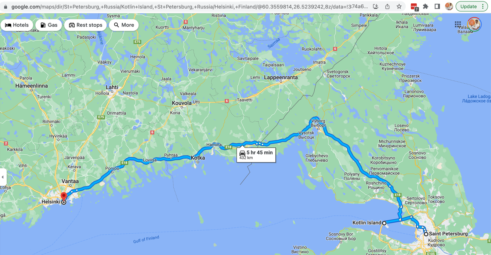

# Full Stack - Kotlin met Angular front-end in a nutshell

## Hands on
Ik volg deze tutorial van de officiële Kotlin website kotlinlang.org.

- https://kotlinlang.org/docs/jvm-spring-boot-restful.html

Korte introductie video over H2 op [youtube.com](https://www.youtube.com/watch?v=6wUQagjtJ4c), maar ik gebruik container image uit [Docker Hub](https://hub.docker.com/r/buildo/h2database) i.v.m. security en makkelijk opruimen:

```bash
docker run --name my-h2 -p 8082:8082 -d buildo/h2database
```

(Dit vereist dat je [Docker Dashboard](https://docs.docker.com/desktop/windows/install/) hebt op Windows/macOS.)


## Kotlin vs Java

Kotlin is de zus van Java. Uit Rusland...!

- No semicolons!
- Functions are fun
- Praat met Java
- No new! (?)
- Methodenamen met spaties erin (? test first)
- Extension methods
- null safety / optionals 
- `var` vs `val` wisselen constante naar variabele met een letter
- Type inference
- if als expressie
- switch wordt when
- data classes (DTO's?)
- 
- En nog veel meer
[Inline classes](https://typealias.com/guides/introduction-to-inline-classes/)

### Kotlin
```kotlin
val a: Int = 100
```

### Java

```Java
int a = 100;
```

- Zie: <https://kotlinlang.org/>
  - Types declaratie erachter (a la Pascal) i.p.v. ervoor zoals in Java
  - Geen punt komma
  - `val` i.p.v. `var`
  - `fun` i.p.v. `function`
  - Interop met Java code via JVM bytcode


## Angular vs JEE

- Angular is a framework, not a library (like React)
  - Ng heeft bv. ook Dependency Injection systeem
  - En UI components, vergelijkbaar met classes, maar dan met view erbij
- Angular is platform, like JEE, maar dan op de front-end.
- Angular !== AngularJS
- Angular gebruikt TypeScript

## TypeScript vs Java


## Angular

Je kunt ook in de browser werken via StackBlitz zoals in de algemene 'getting started' van angular.io, maar ik raad je aan voor serieuze project de [local-setup](https://angular.io/guide/setup-local) guide te volgen. Hiervoor moet je ook [NodeJS])(https://nodejs.org/en/) installeren, eigenlijk alleen om hiermee ook `npm` te kunnen gebruiken om daarmee de Angular cli (command line interface) op te halen.

Op macOS had ik nog problemen omdat `ng ...` commando's niet werkten ([`zsh: command not found: ng`](https://stackoverflow.com/questions/37227794/ng-command-not-found-while-creating-new-project-using-angular-cli), want 
dit nog problemen. Ik moest de folder met npm binary packages nog in path zetten via aanpassen `.zshrc` ([bron: SO](https://stackoverflow.com/questions/12743928/command-not-found-after-npm-install-in-zsh)))

```
This package has installed:
•	Node.js v16.14.2 to /usr/local/bin/node
•	npm v8.5.0 to /usr/local/bin/npm
Make sure that /usr/local/bin is in your $PATH.
```


## Full stack Kotlin
Kotlin bevat als nog onderscheidende feature t.o.v. Java zelfs ook nog de mogelijkheid om behalve naar JVM ook naar JavaScript te compileren/transpileren.Zodat je het zowel op de front-end als backend kunt gebruiken. Zo heb je als developer minder last van 'context switches', en kun je evt. ook code hergebruik doen, bv. voor een 'model driven' aanpak (bv. validatie van input in front-end op basis van attributen op je modellen/entities in de back-end (bv. @Required username: String).Dit noem ik hoogstens echter alleen kort, mogelijk onderzoek voor studenten, maar dit ga ik NIET behandelen. Zeker omdat er nog niet echt aansluiting is met Angular. Dus dan ga je naar React toe, of een Kotlin specifiek framework als 'fritz2'.Angular aansluiting is nog TODO qua Kotlin, maar in het bijbehorende issue wel een mooie pitch waarom Angular toch <https://youtrack.jetbrains.com/issue/KT-21561>